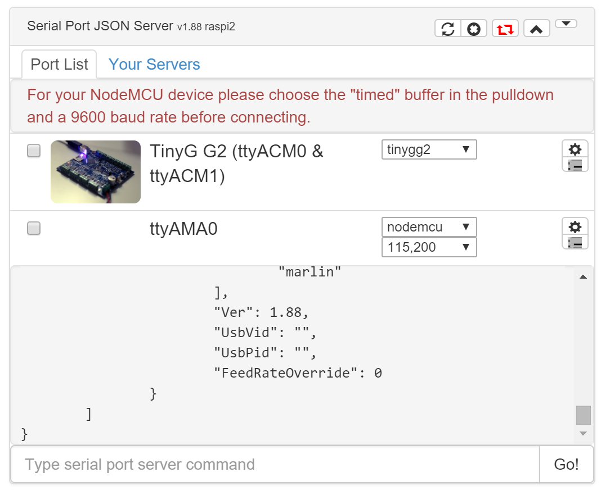

# com-chilipeppr-widget-serialport
The essential widget if you want your workspace to talk to the Serial Port JSON Server (SPJS). This widget enables numerous pubsub signals so you can publish to SPJS and receive data back when you subscribe to the appropriate signals.



## ChiliPeppr Widget / Serial Port JSON Server

All ChiliPeppr widgets/elements are defined using cpdefine() which is a method
that mimics require.js. Each defined object must have a unique ID so it does
not conflict with other ChiliPeppr widgets.

| Item                  | Value           |
| -------------         | ------------- | 
| ID                    | com-chilipeppr-widget-serialport |
| Name                  | Widget / Serial Port JSON Server |
| Description           | The essential widget if you want your workspace to talk to the Serial Port JSON Server (SPJS). This widget enables numerous pubsub signals so you can publish to SPJS and receive data back when you subscribe to the appropriate signals. |
| chilipeppr.load() URL | http://raw.githubusercontent.com/chilipeppr/widget-spjs/master/auto-generated-widget.html |
| Edit URL              | http://ide.c9.io/chilipeppr/widget-spjs |
| Github URL            | http://github.com/chilipeppr/widget-spjs |
| Test URL              | https://preview.c9users.io/chilipeppr/widget-spjs/widget.html |

## Example Code for chilipeppr.load() Statement

You can use the code below as a starting point for instantiating this widget 
inside a workspace or from another widget. The key is that you need to load 
your widget inlined into a div so the DOM can parse your HTML, CSS, and 
Javascript. Then you use cprequire() to find your widget's Javascript and get 
back the instance of it.

```javascript
// Inject new div to contain widget or use an existing div with an ID
$("body").append('<' + 'div id="myDivWidgetSerialport"><' + '/div>');

chilipeppr.load(
  "#myDivWidgetSerialport",
  "http://raw.githubusercontent.com/chilipeppr/widget-spjs/master/auto-generated-widget.html",
  function() {
    // Callback after widget loaded into #myDivWidgetSerialport
    // Now use require.js to get reference to instantiated widget
    cprequire(
      ["inline:com-chilipeppr-widget-serialport"], // the id you gave your widget
      function(myObjWidgetSerialport) {
        // Callback that is passed reference to the newly loaded widget
        console.log("Widget / Serial Port JSON Server just got loaded.", myObjWidgetSerialport);
        myObjWidgetSerialport.init();
      }
    );
  }
);

```

## Publish

This widget/element publishes the following signals. These signals are owned by this widget/element and are published to all objects inside the ChiliPeppr environment that listen to them via the 
chilipeppr.subscribe(signal, callback) method. 
To better understand how ChiliPeppr's subscribe() method works see amplify.js's documentation at http://amplifyjs.com/api/pubsub/

  <table id="com-chilipeppr-elem-pubsubviewer-pub" class="table table-bordered table-striped">
      <thead>
          <tr>
              <th style="">Signal</th>
              <th style="">Description</th>
          </tr>
      </thead>
      <tbody>
      <tr valign="top"><td>/com-chilipeppr-widget-serialport/list</td><td>Sends the list of serial ports shown in this widget including the connect state so other widgets/elements in ChiliPeppr can use the list including knowing what serial ports to send/recv from. Send in /getList and get back a /list with the JSON payload of the list.</td></tr><tr valign="top"><td>/com-chilipeppr-widget-serialport/listAfterMetaDataAdded</td><td>Similar to /list but the list will have meta data added to it like an image, or default baud rates, or a modified friendly name. It may even be marked as deleted for dual port scenarios where a port may be considered the 2nd port.</td></tr><tr valign="top"><td>/com-chilipeppr-widget-serialport/ws/onconnect</td><td>When the websocket connects. This widget currently supports only a single websocket. In the future, multiple websockets will be supported and a ws identifier will be attached. For now, you will receive the string "connected" in the payload. The 2nd parameter will be the websocket in case you need it like to retrieve the IP address of SPJS. For multiple websockets an additional parameter will be published with the ws:// url</td></tr><tr valign="top"><td>/com-chilipeppr-widget-serialport/ws/ondisconnect</td><td>When the websocket disconnects.</td></tr><tr valign="top"><td>/com-chilipeppr-widget-serialport/ws/sys</td><td>A system message. Mostly for visual display like an error.</td></tr><tr valign="top"><td>/com-chilipeppr-widget-serialport/ws/recv</td><td>A signal published when the websocket receives data from the serial port server. The serial port, i.e. COM21, the websocket identifier, and data are sent.</td></tr><tr valign="top"><td>/com-chilipeppr-widget-serialport/onportopen</td><td>Published when the Serial Port JSON Server tells us a port was opened. This could happen from the user clicking to open, or if another browser or websocket client opens it, we will fire off this signal as well. The payload looks like {Cmd: "Open", Desc: "Got register/open on port.", Port: "COM22", Baud: 115200, BufferType: "tinyg"} </td></tr><tr valign="top"><td>/com-chilipeppr-widget-serialport/onportclose</td><td>Published when the Serial Port JSON Server tells us a port was closed. This could happen from the user clicking to close, or if another browser, or SPJS, or websocket client closes it, we will fire off this signal. The payload looks like {Cmd: "Close", Desc: "Got unregister/close on port.", Port: "COM22", Baud: 115200} </td></tr><tr valign="top"><td>/com-chilipeppr-widget-serialport/onportopenfail</td><td>Published when the Serial Port JSON Server tells us a port was attempting to be opened but failed for some reason. This could happen from the user clicking to open, or if another browser tries to open, but an error arose such as the port being locked by another process. The payload looks like {Cmd: "OpenFail", Desc: "Got error reading on port. ", Port: "COM22", Baud: 115200}</td></tr><tr valign="top"><td>/com-chilipeppr-widget-serialport/recvline</td><td>We publish this signal in tandem with /ws/recv but we only publish this signal per newline. That way your widget can consume per line data which is typically the way you want it. We recommend you subscribe to this channel instead of /ws/recv to have less work to do of looking for newlines. When in setSingleSelectMode() we will only send you data for the port that is selected (in green in UI). You will not get this signal for secondary ports that are open. For secondary ports, you need to subscribe to /ws/recv and do lower level parsing.</td></tr><tr valign="top"><td>/com-chilipeppr-widget-serialport/recvVersion</td><td>We send you this back if you published a /requestVersion signal. This is so other widgets can pivot off of what version of Serial Port JSON Server is running. For example, the Arduino/Atmel programmer sends in a /requestVersion to get a callback on /recvVersion to determine if you are at version 1.83 or above to know whether you have the correct functionality.</td></tr><tr valign="top"><td>/com-chilipeppr-widget-serialport/recvSingleSelectPort</td><td>In case any other widget/element wants to know what port is single selected (when in setSingleSelectMode()), they can send a signal to /requestSingleSelectPort and we'll respond back with this signal with an object like: {
  "Name": "COM22",
  "Friendly": "USB Serial Port (COM22)",
  "IsOpen": true,
  "Baud": 115200,
  "RtsOn": true,
  "DtrOn": false,
  "BufferAlgorithm": "tinyg",
  "AvailableBufferAlgorithms": [
    "default",
    "tinyg",
    "dummypause"
  ],
  "Ver": 1.7
}. Will send back a null if no ports or no singleSelectPort is defined.</td></tr><tr valign="top"><td>/com-chilipeppr-widget-serialport/onQueue</td><td>This signal is published when a command is queued on SPJS. Payload is {"Id":"123", "D":"G0 X1
", "QCnt":1, "Port":"COM2"}. You get the data back because if another browser sent into the SPJS, you get that data reflected in other browsers which is important for synchronizing. See /jsonSend for more info.</td></tr><tr valign="top"><td>/com-chilipeppr-widget-serialport/onWrite</td><td>This signal is published when a command is written to the serial port on SPJS. Payload is {"Id":"123", "QCnt":0, "Port":"COM2"}. The serial command is not reiterated in this signal like it is in /onQueue. See /jsonSend for more info.</td></tr><tr valign="top"><td>/com-chilipeppr-widget-serialport/onComplete</td><td>This signal is published when a command is done being written on SPJS and is known to have been processed by the serial device. Payload is {"Id":"123"}. Please note that sometimes /onComplete could come back before /onWrite due to the multi-threaded nature of serial ports and writing/reading as well as network congestion. See /jsonSend for more info.</td></tr><tr valign="top"><td>/com-chilipeppr-widget-serialport/onError</td><td>This signal is published when a command produces an error in the CNC controller either due to a gcode syntax problem, or an unsupported gcode command.  This signal can be used by the cnc-interface widget to handle for errors, or pause/cancel gcode execution so that the problem can be rectified.</td></tr><tr valign="top"><td>/com-chilipeppr-widget-serialport/onBroadcast</td><td>This signal is published when we see a broadcast message come in from SPJS and we simply regurgitate it out on this signal for any widget to listen to. To send a broadcast signal into SPJS you just use the command "broadcast blah blah" and then SPJS re-broadcasts that to all listeners with a packet like {Cmd:"Broadcast", Msg:"blah blah"}. For example, the ShuttleXpress CNC jog shuttle connects to SPJS on its own and when you click buttons on the device it broadcasts them to SPJS so widgets inside ChiliPeppr can respond to those clicks.</td></tr><tr valign="top"><td>/com-chilipeppr-widget-serialport/onAnnounce</td><td>This signal is published when we see an announce message come in from SPJS and we simply regurgitate it out on this signal for any widget to listen to. An announce signal is part of the Cayenn protocol. Basically an IoT device like an ESP8266 sends in a UDP broadcast to the network announcing its existence. SPJS listens for those and then sends a copy of the announcement to any SPJS listeners, like us. Then this SPJS widget publishes it out so other widgets inside ChiliPeppr can listen for the message.</td></tr><tr valign="top"><td>/com-chilipeppr-widget-serialport/onFeedRateOverride</td><td>This signal is published when we get a feed rate override update from SPJS. It will contain the payload similar to {"Cmd":"FeedRateOverride","Desc":"Providing you status of feed rate override.","Port":"COM7","FeedRateOverride":0,"IsOn":false}</td></tr><tr valign="top"><td>/com-chilipeppr-widget-serialport/recvStatus</td><td>Send in a /requestStatus and we will send you back a /recvStatus letting you know if SPJS is connected or not to the Serial Port JSON Server. The payload that comes to you in /recvStatus looks like {"Connected":true, "Websocket": ws } or {"connected":false, "websocket":null}. If you want to be pushed an event when the socket connects or disconnects you should subscribe to /ws/onconnect and /ws/ondisconnect</td></tr>    
      </tbody>
  </table>

## Subscribe

This widget/element subscribes to the following signals. These signals are owned by this widget/element. Other objects inside the ChiliPeppr environment can publish to these signals via the chilipeppr.publish(signal, data) method. 
To better understand how ChiliPeppr's publish() method works see amplify.js's documentation at http://amplifyjs.com/api/pubsub/

  <table id="com-chilipeppr-elem-pubsubviewer-sub" class="table table-bordered table-striped">
      <thead>
          <tr>
              <th style="">Signal</th>
              <th style="">Description</th>
          </tr>
      </thead>
      <tbody>
      <tr valign="top"><td>/com-chilipeppr-widget-serialport/ws/send</td><td>This widget subscribes to this signal so anybody can publish 
to SPJS by publishing here. You can send any command that SPJS supports. Please see the 
docs for all support SPJS commands on Github at 
<a target="_blank" href="https://github.com/chilipeppr/serial-port-json-server#supported-commands">https://github.com/chilipeppr/serial-port-json-server#supported-commands</a>.
<br><br>
Example<br>
chilipeppr.publish("/com-chilipeppr-widget-serialport/ws/send", "send COM22 G0 X0\n");
<br><br>
Example of sending non-buffered command<br>
chilipeppr.publish("/com-chilipeppr-widget-serialport/ws/send", "sendnobuf /dev/ttyUSB0 M3 S1000\n");
</td></tr><tr valign="top"><td>/com-chilipeppr-widget-serialport/send</td><td>This widget subscribes to this signal whereby you can simply send 
to this pubsub channel (instead of /ws/send which is lower level) and the widget will
send to the default serial ports that you are connected to (the green highlight in the UI). 
Most serial devices expect newline characters, so you should send those in your string as 
this pubsub channel does not add them.
<br><br>
Example<br>
chilipeppr.publish("/com-chilipeppr-widget-serialport/send", "G1 X10 F500\n");
</td></tr><tr valign="top"><td>/com-chilipeppr-widget-serialport/jsonSend</td><td><p>This signal is like /send but a more structured version where you can send us commands like {"D": "G0 X1
", "Id":"123"} or an array like [{"D": "G0 X1
", "Id":"123"}, {"D": "G0 X2
", "Id":"124"}] and then this widget will send callback signals in order of /onQueue, /onWrite, /onComplete. The payload is {"Id":"123"} on each of those.</p> <p>The SPJS has 3 steps to get your command to the serial device. Step 1 is /onQueue and this will come back immediately when SPJS has taken your command and queued it to memory/disk. Step 2 is /onWrite when SPJS actually has written your command to the serial device. If the device takes a while to execute the command it could be a bit of time until that command is physically executed. Step 3 is /onComplete which is SPJS attempting to watch for a response from the serial device to determine that indeed your command is executed. Please note /onComplete can come back prior to /onWrite based on your serial device and how fast it may have executed your serial command.</p> <p>You can omit the Id if you do not care about tracking. You will get callbacks with an empty Id so you will not be able to match them up. If you send in /jsonSend {"D": "G0 X1
G0 X0
", "Id":"123"} you will get back /onQueue [{"D":"G0 X1
","Id":"123","Buf":"Buf"},{"D":"G0 X0
","Id":"123-part-2-2","Buf":"Buf"}] because technically those are 2 commands with one Id. Some commands sent into Serial Port JSON Server get additional commands auto-added. For example, if you send in a command to TinyG that would put it in text mode, SPJS appends a command to put TinyG back in JSON mode. In those cases you will get parts added to your command and will see that in the response.</p></td></tr><tr valign="top"><td>/com-chilipeppr-widget-serialport/getlist</td><td>In case any other widget/element wants to request the list at any time, they can send a signal to this channel and we'll respond back with a /list</td></tr><tr valign="top"><td>/com-chilipeppr-widget-serialport/requestVersion</td><td>Send in this signal to get back a /recvVersion. This is so other widgets can pivot off of what version of Serial Port JSON Server is running. For example, the Arduino/Atmel programmer sends in a /requestVersion to get a callback on /recvVersion to determine if you are at version 1.83 or above to know whether you have the correct functionality.</td></tr><tr valign="top"><td>/com-chilipeppr-widget-serialport/requestSingleSelectPort</td><td>In case any other widget/element wants to know what port is single selected (when in setSingleSelectMode()), they can send a signal to this channel and we'll respond back with a /recvSingleSelectPort with an object like: {
  "Name": "COM22",
  "Friendly": "USB Serial Port (COM22)",
  "IsOpen": true,
  "Baud": 115200,
  "RtsOn": true,
  "DtrOn": false,
  "BufferAlgorithm": "tinyg",
  "AvailableBufferAlgorithms": [
    "default",
    "tinyg",
    "dummypause"
  ],
  "Ver": 1.7
}. Will send back a null if no ports or no singleSelectPort is defined.</td></tr><tr valign="top"><td>/com-chilipeppr-widget-serialport/requestFro</td><td>Send in this signal to have this widget send in a request to SPJS for the Feed Rate Override status on the singleSelectPort, i.e. the port that is hilited green. This widget will send SPJS something like "fro COM7" and then the data will come back and a publish will occur on /onFeedRateOverride. If you send in an empty payload this will simply request the status. If you send in a float or integer it will actually set the Feed Rate Override multiplier to that value.</td></tr><tr valign="top"><td>/com-chilipeppr-widget-serialport/requestStatus</td><td>If you want to request the connected/disconnected status of this widget, you can send this pubsub signal in and we will send you back the connected status in the /recvStatus signal. We will also include the websocket object in case you were interested in it. Please see docs for /recvStatus for further info.</td></tr>    
      </tbody>
  </table>

## Foreign Publish

This widget/element publishes to the following signals that are owned by other objects. 
To better understand how ChiliPeppr's subscribe() method works see amplify.js's documentation at http://amplifyjs.com/api/pubsub/

  <table id="com-chilipeppr-elem-pubsubviewer-foreignpub" class="table table-bordered table-striped">
      <thead>
          <tr>
              <th style="">Signal</th>
              <th style="">Description</th>
          </tr>
      </thead>
      <tbody>
      <tr valign="top"><td>/com-chilipeppr-widget-serialport/com-chilipeppr-elem-flashmsg/flashmsg</td><td>We publish system messages from the serial port server to the flash message element to display informational messages to the user.</td></tr><tr valign="top"><td>/com-chilipeppr-widget-serialport/com-chilipeppr-interface-cnccontroller/plannerpause</td><td>We publish a planner pause if we see that the buffer count in the Serial Port JSON Server gets above 20,000.</td></tr><tr valign="top"><td>/com-chilipeppr-widget-serialport/com-chilipeppr-interface-cnccontroller/plannerresume</td><td>We publish a planner resume when we get back to 15,000.</td></tr>    
      </tbody>
  </table>

## Foreign Subscribe

This widget/element publishes to the following signals that are owned by other objects.
To better understand how ChiliPeppr's publish() method works see amplify.js's documentation at http://amplifyjs.com/api/pubsub/

  <table id="com-chilipeppr-elem-pubsubviewer-foreignsub" class="table table-bordered table-striped">
      <thead>
          <tr>
              <th style="">Signal</th>
              <th style="">Description</th>
          </tr>
      </thead>
      <tbody>
      <tr><td colspan="2">(No signals defined in this widget/element)</td></tr>    
      </tbody>
  </table>

## Methods / Properties

The table below shows, in order, the methods and properties inside the widget/element.

  <table id="com-chilipeppr-elem-methodsprops" class="table table-bordered table-striped">
      <thead>
          <tr>
              <th style="">Method / Property</th>
              <th>Type</th>
              <th style="">Description</th>
          </tr>
      </thead>
      <tbody>
      <tr valign="top"><td>id</td><td>string</td><td>"com-chilipeppr-widget-serialport"</td></tr><tr valign="top"><td>name</td><td>string</td><td>"Widget / Serial Port JSON Server"</td></tr><tr valign="top"><td>desc</td><td>string</td><td>"The essential widget if you want your workspace to talk to the Serial Port JSON Server (SPJS). This widget enables numerous pubsub signals so you can publish to SPJS and receive data back when you subscribe to the appropriate signals."</td></tr><tr valign="top"><td>url</td><td>string</td><td>"http://raw.githubusercontent.com/chilipeppr/widget-spjs/master/auto-generated-widget.html"</td></tr><tr valign="top"><td>fiddleurl</td><td>string</td><td>"http://ide.c9.io/chilipeppr/widget-spjs"</td></tr><tr valign="top"><td>githuburl</td><td>string</td><td>"http://github.com/chilipeppr/widget-spjs"</td></tr><tr valign="top"><td>testurl</td><td>string</td><td>"http://widget-spjs-chilipeppr.c9users.io/widget.html"</td></tr><tr valign="top"><td>publish</td><td>object</td><td>Please see docs above.</td></tr><tr valign="top"><td>subscribe</td><td>object</td><td>Please see docs above.</td></tr><tr valign="top"><td>foreignPublish</td><td>object</td><td>Please see docs above.</td></tr><tr valign="top"><td>isWsConnected</td><td>boolean</td><td></td></tr><tr valign="top"><td>host</td><td>object</td><td></td></tr><tr valign="top"><td>portlist</td><td>object</td><td></td></tr><tr valign="top"><td>conn</td><td>object</td><td></td></tr><tr valign="top"><td>isSingleSelectMode</td><td>boolean</td><td></td></tr><tr valign="top"><td>singleSelectPort</td><td>object</td><td></td></tr><tr valign="top"><td>buffertype</td><td>object</td><td></td></tr><tr valign="top"><td>defaultBaud</td><td>object</td><td></td></tr><tr valign="top"><td>defaultOptions</td><td>object</td><td></td></tr><tr valign="top"><td>isInitted</td><td>boolean</td><td></td></tr><tr valign="top"><td>init</td><td>function</td><td>function (host, buffertype, defaultBaud, buffertypeDescription) </td></tr><tr valign="top"><td>setupSubnetScan</td><td>function</td><td>function () </td></tr><tr valign="top"><td>setupRecentServerList</td><td>function</td><td>function () </td></tr><tr valign="top"><td>showRecentServerList</td><td>function</td><td>function () </td></tr><tr valign="top"><td>setupStatusPubSub</td><td>function</td><td>function () </td></tr><tr valign="top"><td>onRequestStatus</td><td>function</td><td>function () </td></tr><tr valign="top"><td>setupFroPubSub</td><td>function</td><td>function () </td></tr><tr valign="top"><td>onRequestFro</td><td>function</td><td>function (payload) </td></tr><tr valign="top"><td>version</td><td>object</td><td></td></tr><tr valign="top"><td>versionFloat</td><td>number</td><td></td></tr><tr valign="top"><td>setupVersionPubSub</td><td>function</td><td>function () </td></tr><tr valign="top"><td>onRequestVersion</td><td>function</td><td>function () </td></tr><tr valign="top"><td>onVersion</td><td>function</td><td>function (version) </td></tr><tr valign="top"><td>resetVersion</td><td>function</td><td>function () </td></tr><tr valign="top"><td>hideVersion</td><td>function</td><td>function () </td></tr><tr valign="top"><td>resetSpjsName</td><td>function</td><td>function () </td></tr><tr valign="top"><td>onSpjsName</td><td>function</td><td>function (spjsName) </td></tr><tr valign="top"><td>setupCloudServers</td><td>function</td><td>function () </td></tr><tr valign="top"><td>onCloudServerClick</td><td>function</td><td>function (evt) </td></tr><tr valign="top"><td>showBufferEncouragement</td><td>function</td><td>function () </td></tr><tr valign="top"><td>hideBufferEncouragement</td><td>function</td><td>function () </td></tr><tr valign="top"><td>bufferEncouragement</td><td>function</td><td>function (list, arg2) </td></tr><tr valign="top"><td>publishSingleSelectPort</td><td>function</td><td>function () </td></tr><tr valign="top"><td>onRemoteHostConnect</td><td>function</td><td>function () </td></tr><tr valign="top"><td>setSingleSelectMode</td><td>function</td><td>function () </td></tr><tr valign="top"><td>getPortListCount</td><td>number</td><td></td></tr><tr valign="top"><td>getPortList</td><td>function</td><td>function () </td></tr><tr valign="top"><td>btnBarSetup</td><td>function</td><td>function () </td></tr><tr valign="top"><td>restartSpjs</td><td>function</td><td>function () </td></tr><tr valign="top"><td>exitSpjs</td><td>function</td><td>function () </td></tr><tr valign="top"><td>disconnect</td><td>function</td><td>function () </td></tr><tr valign="top"><td>consoleToggle</td><td>function</td><td>function () </td></tr><tr valign="top"><td>statusToggle</td><td>function</td><td>function () </td></tr><tr valign="top"><td>history</td><td>object</td><td></td></tr><tr valign="top"><td>historyLastShownIndex</td><td>object</td><td></td></tr><tr valign="top"><td>pushOntoHistory</td><td>function</td><td>function (cmd) </td></tr><tr valign="top"><td>onHistoryMenuClick</td><td>function</td><td>function (evt) </td></tr><tr valign="top"><td>consoleSetup</td><td>function</td><td>function () </td></tr><tr valign="top"><td>log</td><td>object</td><td></td></tr><tr valign="top"><td>logIsShowing</td><td>boolean</td><td></td></tr><tr valign="top"><td>appendLogOld</td><td>function</td><td>function (msg) </td></tr><tr valign="top"><td>appendLogEchoCmd</td><td>function</td><td>function (msg) </td></tr><tr valign="top"><td>logEls</td><td>object</td><td></td></tr><tr valign="top"><td>appendLog</td><td>function</td><td>function (msg) </td></tr><tr valign="top"><td>sendbuf</td><td>object</td><td></td></tr><tr valign="top"><td>isSendBufWaiting</td><td>boolean</td><td></td></tr><tr valign="top"><td>sendBuffered</td><td>function</td><td>function (msg) </td></tr><tr valign="top"><td>sendBufferedDoNext</td><td>function</td><td>function () </td></tr><tr valign="top"><td>sendBufferedOnWsRecv</td><td>function</td><td>function (data) </td></tr><tr valign="top"><td>sendbufjson</td><td>object</td><td></td></tr><tr valign="top"><td>isSendBufWaitingJson</td><td>boolean</td><td></td></tr><tr valign="top"><td>clearBuffer</td><td>function</td><td>function () </td></tr><tr valign="top"><td>sendBufferedJson</td><td>function</td><td>function (msg) </td></tr><tr valign="top"><td>sendBufferedDoNextJson</td><td>function</td><td>function () </td></tr><tr valign="top"><td>sendBufferedOnWsRecvJson</td><td>function</td><td>function (data) </td></tr><tr valign="top"><td>sendFromConsole</td><td>function</td><td>function (msg) </td></tr><tr valign="top"><td>sendViaJson</td><td>function</td><td>function (json) </td></tr><tr valign="top"><td>onQueuedJson</td><td>function</td><td>function (data) </td></tr><tr valign="top"><td>onQueuedText</td><td>function</td><td>function (data) </td></tr><tr valign="top"><td>onWriteJson</td><td>function</td><td>function (data) </td></tr><tr valign="top"><td>onCompleteJson</td><td>function</td><td>function (data) </td></tr><tr valign="top"><td>onErrorJson</td><td>function</td><td>function (data)</td></tr><tr valign="top"><td>onBroadcast</td><td>function</td><td>function (data)</td></tr><tr valign="top"><td>onAnnounce</td><td>function</td><td>function (data)</td></tr><tr valign="top"><td>onFeedRateOverride</td><td>function</td><td>function (data) </td></tr><tr valign="top"><td>send</td><td>function</td><td>function (msg) </td></tr><tr valign="top"><td>sendNoBuf</td><td>function</td><td>function (msg) </td></tr><tr valign="top"><td>wsSend</td><td>function</td><td>function (msg) </td></tr><tr valign="top"><td>serialSaveCookie</td><td>function</td><td>function (portname, baud, isrts, isdtr, buffer) </td></tr><tr valign="top"><td>serialGetCookie</td><td>function</td><td>function (portname) </td></tr><tr valign="top"><td>serialConnect</td><td>function</td><td>function (portname, baud, buffer) </td></tr><tr valign="top"><td>serialDisconnect</td><td>function</td><td>function (portname) </td></tr><tr valign="top"><td>reconMsgShow</td><td>function</td><td>function () </td></tr><tr valign="top"><td>reconMsgHide</td><td>function</td><td>function () </td></tr><tr valign="top"><td>wsWasEverConnected</td><td>boolean</td><td></td></tr><tr valign="top"><td>wsConnect</td><td>function</td><td>function (hostname, onsuccess, onfail) </td></tr><tr valign="top"><td>wsScan</td><td>function</td><td>function (callback, subnet) </td></tr><tr valign="top"><td>serverListSet</td><td>function</td><td>function (key, val) </td></tr><tr valign="top"><td>serverListGet</td><td>function</td><td>function () </td></tr><tr valign="top"><td>lastMsg</td><td>object</td><td></td></tr><tr valign="top"><td>lastMsgTime</td><td>number</td><td></td></tr><tr valign="top"><td>publishSysMsg</td><td>function</td><td>function (msg) </td></tr><tr valign="top"><td>deDupeLastMsg</td><td>object</td><td></td></tr><tr valign="top"><td>isInDeDupeMode</td><td>boolean</td><td></td></tr><tr valign="top"><td>publishMsg</td><td>function</td><td>function (msg) </td></tr><tr valign="top"><td>dataBuffer</td><td>object</td><td></td></tr><tr valign="top"><td>onWsMessage</td><td>function</td><td>function (msg) </td></tr><tr valign="top"><td>configSendCtr</td><td>number</td><td></td></tr><tr valign="top"><td>onPortOpen</td><td>function</td><td>function (data) </td></tr><tr valign="top"><td>onPortClose</td><td>function</td><td>function (data) </td></tr><tr valign="top"><td>onPortOpenFail</td><td>function</td><td>function (data) </td></tr><tr valign="top"><td>toSafePortName</td><td>function</td><td>function (portname) </td></tr><tr valign="top"><td>fromSafePortName</td><td>function</td><td>function (safeportname) </td></tr><tr valign="top"><td>onPlannerResumeSetup</td><td>function</td><td>function () </td></tr><tr valign="top"><td>onPlannerResume</td><td>function</td><td>function () </td></tr><tr valign="top"><td>queueMax</td><td>object</td><td></td></tr><tr valign="top"><td>queueEls</td><td>object</td><td></td></tr><tr valign="top"><td>sendPauseAt</td><td>number</td><td></td></tr><tr valign="top"><td>sendResumeAt</td><td>number</td><td></td></tr><tr valign="top"><td>isPlannerPaused</td><td>boolean</td><td></td></tr><tr valign="top"><td>onUpdateQueueCnt</td><td>function</td><td>function (data) </td></tr><tr valign="top"><td>deviceMeta</td><td>object</td><td></td></tr><tr valign="top"><td>setPortItemsFromMetaData</td><td>function</td><td>function (dm /*device meta*/, item /*port*/, portlistIndex) </td></tr><tr valign="top"><td>isInitting</td><td>boolean</td><td></td></tr><tr valign="top"><td>onPortList</td><td>function</td><td>function (portlist) </td></tr><tr valign="top"><td>showAllPopovers</td><td>function</td><td>function () </td></tr><tr valign="top"><td>hideAllPopovers</td><td>function</td><td>function () </td></tr><tr valign="top"><td>onPortSetDefaultClicked</td><td>function</td><td>function (evt) </td></tr><tr valign="top"><td>onPortProgramClicked</td><td>function</td><td>function (evt) </td></tr><tr valign="top"><td>onPortConfigClicked</td><td>function</td><td>function (evt) </td></tr><tr valign="top"><td>onPortConfigModalSave</td><td>function</td><td>function (evt) </td></tr><tr valign="top"><td>currentUser</td><td>object</td><td></td></tr><tr valign="top"><td>checkLogin</td><td>function</td><td>function () </td></tr><tr valign="top"><td>getUserDataKeysFromChiliPepprStorage</td><td>function</td><td>function () </td></tr><tr valign="top"><td>onCloudScriptFileClicked</td><td>function</td><td>function (evt) </td></tr><tr valign="top"><td>onPortFriendlyClicked</td><td>function</td><td>function (evt) </td></tr><tr valign="top"><td>onPortCbClicked</td><td>function</td><td>function (evt) </td></tr><tr valign="top"><td>bufferAlgorithms</td><td>object</td><td></td></tr><tr valign="top"><td>getBufferAlgorithms</td><td>function</td><td>function () </td></tr><tr valign="top"><td>getBaudRates</td><td>function</td><td>function () </td></tr><tr valign="top"><td>onWsConnect</td><td>function</td><td>function (event) </td></tr><tr valign="top"><td>onWsDisconnect</td><td>function</td><td>function (event) </td></tr><tr valign="top"><td>statusWatcher</td><td>function</td><td>function () </td></tr><tr valign="top"><td>initBody</td><td>function</td><td>function (evt) </td></tr><tr valign="top"><td>toggleBody</td><td>function</td><td>function (evt) </td></tr><tr valign="top"><td>showBody</td><td>function</td><td>function (evt) </td></tr><tr valign="top"><td>hideBody</td><td>function</td><td>function (evt) </td></tr><tr valign="top"><td>forkSetup</td><td>function</td><td>function () </td></tr>
      </tbody>
  </table>


## About ChiliPeppr

[ChiliPeppr](http://chilipeppr.com) is a hardware fiddle, meaning it is a 
website that lets you easily
create a workspace to fiddle with your hardware from software. ChiliPeppr provides
a [Serial Port JSON Server](https://github.com/johnlauer/serial-port-json-server) 
that you run locally on your computer, or remotely on another computer, to connect to 
the serial port of your hardware like an Arduino or other microcontroller.

You then create a workspace at ChiliPeppr.com that connects to your hardware 
by starting from scratch or forking somebody else's
workspace that is close to what you are after. Then you write widgets in
Javascript that interact with your hardware by forking the base template 
widget or forking another widget that
is similar to what you are trying to build.

ChiliPeppr is massively capable such that the workspaces for 
[TinyG](http://chilipeppr.com/tinyg) and [Grbl](http://chilipeppr.com/grbl) CNC 
controllers have become full-fledged CNC machine management software used by
tens of thousands.

ChiliPeppr has inspired many people in the hardware/software world to use the
browser and Javascript as the foundation for interacting with hardware. The
Arduino team in Italy caught wind of ChiliPeppr and now
ChiliPeppr's Serial Port JSON Server is the basis for the 
[Arduino's new web IDE](https://create.arduino.cc/). If the Arduino team is excited about building on top
of ChiliPeppr, what
will you build on top of it?

